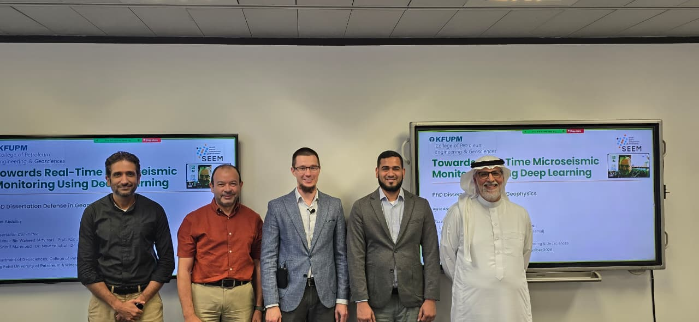

On September 3, 2026, **Ayrat Abdullin** stood before his committee in the Department of Geosciences, College of Petroleum Engineering & Geosciences, at King Fahd University of Petroleum & Minerals, to defend his PhD dissertation, *Towards Real-Time Microseismic Monitoring Using Deep Learning*. The dissertation, completed under the supervision of Dr. Umair bin Waheed, closes out several years of work at the intersection of deep learning and subsurface monitoring.

Rather than a single, self-contained thesis, the dissertation is a compilation of five research papers, each addressing a different stage of the same problem: making microseismic monitoring fast, reliable, and usable in real time. Together, they cover the full pipeline — detection, classification, phase picking, source localization, and velocity estimation — each rebuilt around deep learning methods designed to work under real-world constraints on speed and data availability.

## The five papers

1. **Explainable detection.** Applies Gradient-weighted Class Activation Mapping (Grad-CAM) and Shapley Additive Explanations (SHAP) to a PhaseNet-style detector, showing that explainability tools can do more than interpret a black-box model — a SHAP-gated version of the network improved robustness to noise, reaching an F1-score of 0.98 on a 9,000-waveform test set versus 0.97 for the baseline.
2. **Lightweight classification.** Introduces a compact Fourier Neural Operator for discriminating genuine microseismic events from noise in continuous data streams, cutting the computational cost that has kept many high-accuracy deep learning detectors out of real-time deployment.
3. **Data-efficient phase picking.** Adapts PhaseNO, a network-wide earthquake phase picker pre-trained on more than 57,000 records, to hydraulic-fracturing microseismic data using parameter-efficient transfer learning — fine-tuning only 3.6% of the model's parameters on 200 labeled recordings while keeping the accuracy gains of the large pre-trained network.
4. **Physics-informed source localization.** Extends a U-shaped, physics-informed neural operator to distributed acoustic sensing (DAS) data for microseismic source localization, tested on data from the Utah FORGE geothermal field.
5. **Joint velocity and location inversion.** Proposes a conditional Schrödinger bridge formulation to jointly recover subsurface velocity structure and microseismic source locations, connecting the dissertation's monitoring tools to the broader inversion problem.

Taken together, the five papers work toward the same goal: deep learning systems accurate enough for operational monitoring of induced seismicity and reservoir stimulation, without requiring more data or compute than a real monitoring network can provide.

{.img-fluid}

The dissertation committee included Dr. Umair bin Waheed (Advisor), Prof. Abdullatif Al-Shuhail, Dr. Sherif Mahmoud, Dr. Naveed Iqbal, and Dr. Leo Eisner (External). Congratulations to Ayrat on this achievement.
