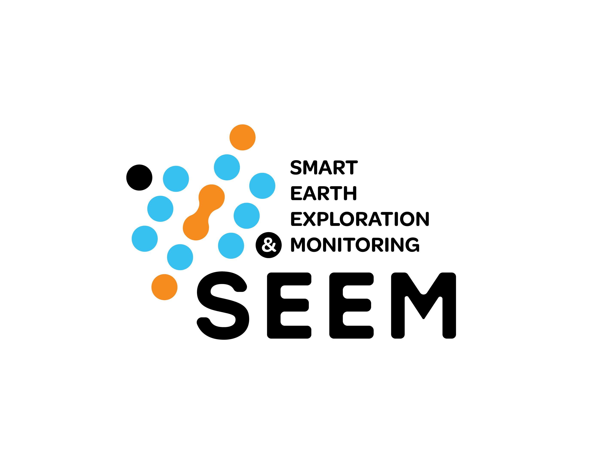

::: {.hero}
::: {.hero-grid}
::: {}

Smart Earth Exploration and Monitoring · CPG · KFUPM

# We make the subsurface clearer.

SEEM develops computational methods for sensing, monitoring, imaging, and interpreting the Earth—connecting geoscience, signal processing, and scientific machine learning.

::: {.hero-actions}
[Explore our research](research.qmd){.btn .btn-light}
[View selected software](projects/index.qmd){.btn .btn-outline-light}
:::
:::

::: {}
{.hero-logo alt="Smart Earth Exploration and Monitoring Group"}
:::
:::
:::

::: {.section-band}
::: {.section-intro}
## Four connected research themes

We combine practical Earth observations with reproducible computational research, from field-scale monitoring to transparent geological interpretation.
:::

::: {.feature-grid}
::: {.feature-card}

01 · SIGNAL

### Monitoring & microseismicity

Detection, characterization, and localization of seismic events.
:::

::: {.feature-card}

02 · SENSING

### DAS & VSP analysis

Signal processing and deep learning for distributed acoustic sensing observations.
:::

::: {.feature-card}

03 · COMPUTATION

### Scientific machine learning

Neural operators and physics-informed learning for inverse problems and reconstruction.
:::

::: {.feature-card}

04 · INSIGHT

### Geological interpretation

Explainable AI and reconstruction tools for transparent subsurface interpretation.
:::
:::
:::

::: {.section-band .soft}
::: {.section-intro}
## Selected work

The website explains why each result matters; GitHub remains the technical source of truth.
:::

::: {.project-grid}
::: {.project-card}
Prototype project card

### SeisReconNO

A U-Net-enhanced Fourier neural operator approach for reconstructing missing traces in 3D seismic data.

Neural operators3D seismicOpen source

::: {.card-actions}
[Project story](projects/seisreconno.qmd){.btn .btn-sm .btn-primary}
[GitHub](https://github.com/SEEM-KFUPM/SeisReconNO){.btn .btn-sm .btn-outline-primary}
:::
:::

::: {.project-card}
Quarto feature demo

### From code to research story

An executable Python page turns a synthetic seismic experiment into a figure, a quality table, and a reproducible explanation.

PythonJupyterReproducibility

::: {.card-actions}
[Open notebook demo](examples/python.qmd){.btn .btn-sm .btn-primary}
:::
:::
:::

::: {.metric-strip}
::: {.metric}
**Markdown + `.qmd`**
Reviewable source
:::
::: {.metric}
**Python + citations**
Scientific publishing
:::
::: {.metric}
**Static HTML**
GitHub Pages ready
:::
:::
:::

::: {.section-band}
::: {.section-intro}
## Publications and people

The prototype begins with one verified public record and one visibly labeled profile placeholder. Approved team data can replace the placeholder without changing the design.
:::

::: {.project-grid}
::: {.project-card}
### Selected publication

Traversa *et al.* present SeisReconNO, combining Fourier neural operators and a U-Net-enhanced architecture for 3D seismic reconstruction [@traversa2026seisreconno].

[Browse publications](publications/index.qmd)
:::

::: {.project-card}
### A sustainable contribution path

Students and postdocs can copy a short `.qmd` template, preview locally, and open a pull request. Metadata powers the people, projects, and news listings automatically.

[See the prototype profile](people/index.qmd) · [Read the workflow note](news/posts/prototype-workflow.qmd)
:::
:::
:::

::: {.section-band .soft}
::: {.cta-band}
::: {}
## Work with SEEM

Explore our open-source work, propose a collaboration, or help prepare approved public information for the group.
:::

[Join / Contact](join.qmd){.btn .btn-light .btn-lg}
:::
:::
