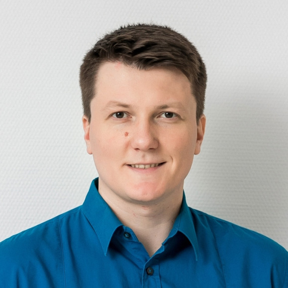

:::: {.member-profile-intro}
::: {.member-profile-portrait-wrap}

:::

::: {.member-profile-summary}
Dr. Denis Anikiev is a Research Scientist at the Center for Integrative Petroleum Research (CIPR), King Fahd University of Petroleum and Minerals. His work combines computational geophysics, data analytics, and scientific software development to address geoscientific challenges.

Before joining KFUPM, Denis worked on large-scale geological modelling and software development at the GFZ Helmholtz Centre for Geosciences. He holds a Ph.D. in Geophysics from St. Petersburg State University.
:::
::::

## Research interests

- AI and machine learning in geoscience
- Distributed acoustic sensing (DAS) processing
- Microseismic imaging and induced seismicity
- Seismic inversion and geothermal exploration
- Potential-field and coupled subsurface-process modelling
- Open scientific software

## Links

- [KFUPM / CPG profile](https://cpg.kfupm.edu.sa/bio/dr-denis-anikiev/)
- [Email Denis Anikiev](mailto:denis.anikiev@kfupm.edu.sa)

## Latest blog posts

::: {#denis-news}
:::
